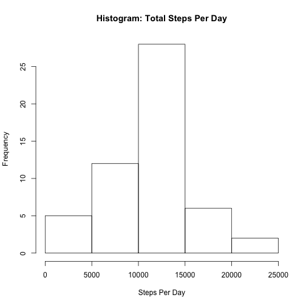
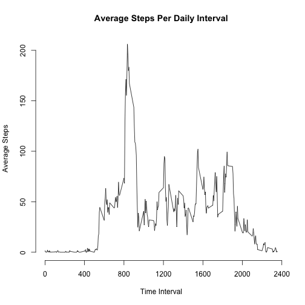
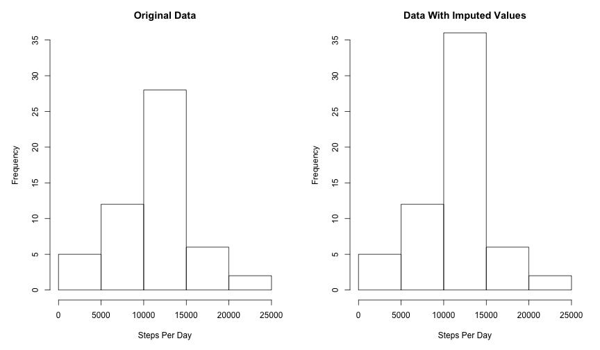
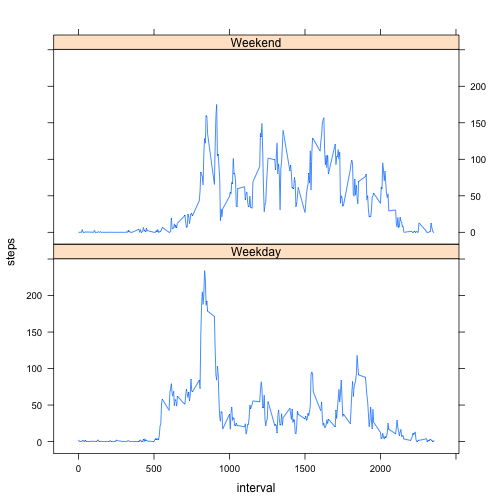

Reproducible Research: Peer Assessment 1
============================================

The following assignment analyzes a set of activity data using the R language.  The data are the number of steps recorded on a personal activity monitoring device taken at five minute intervals for two months.  

## Loading and preprocessing the data

The data were provided in a comma-delimited file, and the file will be loaded using read.csv with all the defaults.


```r
  activity <- read.csv("activity.csv")
```


## What is mean total number of steps taken per day?

First, aggregate the data to calculate the total number of steps per day.


```r
  steps.per.day <- aggregate(steps ~ date, data=activity, sum, na.rm=T)
```

Next, let's look at the mean and median steps per day. For this part of the assignment, any missing data will be ignored.


```r
  average.steps.per.day <- mean(steps.per.day$steps, na.rm=T)
  median.steps.per.day <- median(steps.per.day$steps, na.rm=T)
  names(average.steps.per.day) <- "Average"
  names(median.steps.per.day) <- "Median"
  print(c(average.steps.per.day,median.steps.per.day))
```

```
##  Average   Median 
## 10766.19 10765.00
```

Finally, to get an overall look at the distribution, here is a histogram of the total steps per day.


```r
  hist(steps.per.day$steps, xlab= "Steps Per Day",main="Histogram: Total Steps Per Day")
```

 

## What is the average daily activity pattern?

To show the daily activity pattern, we will produce a time series plot showing the average number of steps per interval taken across all days in the two month period.

First, we will aggregate the data by interval.


```r
  average.steps.per.interval <- aggregate(steps ~ interval, data=activity, mean, na.rm=T)
```

Then we will create a time series plot with the time of day as the x-axis, showing the average steps in each five-minute interval.


```r
  time.interval <- average.steps.per.interval$interval
  average.steps <- average.steps.per.interval$steps
  plot(time.interval,average.steps, type="l", axes=F,
       xlab="Time Interval",ylab="Average Steps",main="Average Steps Per Daily Interval")
  axis(side=1, at=seq(0, 2400, by=400))
  axis(side=2, at=seq(0, 200, by=50))
```

 

As you can see on the chart, there is a distinct spike in the data after 8:00am.  The greatest average number of steps is 206.17 steps at 8:35am, which we can query with the code below:


```r
average.steps.per.interval[average.steps.per.interval$steps==max(average.steps.per.interval$steps),]
```

```
##     interval    steps
## 104      835 206.1698
```

## Imputing missing values

How many of the steps elements are missing values? Let's create a subset of activity that only has records with an NA value in steps, and see how many rows it has.


```r
activity.na <- activity[is.na(activity$steps),]
length(activity.na[,1])
```

```
## [1] 2304
```

There are 2,304 rows missing steps values. Before proceeding with a method of imputing the missing values, it might be beneficial to see where the missing values are occuring. On which days are the missing values located?


```r
table(as.character(activity.na$date))
```

```
## 
## 2012-10-01 2012-10-08 2012-11-01 2012-11-04 2012-11-09 2012-11-10 
##        288        288        288        288        288        288 
## 2012-11-14 2012-11-30 
##        288        288
```

There are missing values on eight of the 61 days in the data.  More interestingly, all 288 of the intervals are missing values on those days. The missing values are not from random or evenly distributed intervals across all days, but all intervals on specific days. We might imagine that the subject forgot to wear or turn on the device on those days, though of course we have no way of knowing that for certain. But we do know that all intervals are missing values on certain days and all other days have no intervals with missing values.

This makes analysis with imputed values much simpler. If the missing values were distributed random intervals throughout the test period, we would need to replace each missing interval value with the interval average. However, instead we just need to come up with a number of total steps for the average day, and we calculated that already in the first step of this assignment. It is 10766.19.

Now, let's create a copy of the data frame with total steps per day.  To that data frame we will append the eight missing days using the average daily value as the total steps.


```r
steps.per.day.missing <- data.frame(unique(as.character(activity.na$date)), rep(average.steps.per.day,each=8))
colnames(steps.per.day.missing) <- c("date","steps")
steps.per.day.fill <- rbind(steps.per.day,steps.per.day.missing)
```

And here is a histogram of the daily total steps for both the original data set and the new data set with the missing values replaced with average steps per day. Since all the added values were the average, it caused the frequency of the center bin to increase by eight and the rest of the distribution to remain the same.


```r
  par(mfrow=c(1,2),mar=c(5,5,3,2))
  hist(steps.per.day$steps, ylim=c(0,35),xlab= "Steps Per Day",main="Original Data")
  hist(steps.per.day.fill$steps, ylim=c(0,35),xlab= "Steps Per Day",main="Data With Imputed Values")
```

 

## Are there differences in activity patterns between weekdays and weekends?

To see the difference, we can add a field to the data that flags weekend days vs. weekdays. 


```r
  activity$weekday <- weekdays(as.Date(activity$date))
  activity$weekend.flag <- "Weekday"
  weekend <- substr(activity$weekday,1,1)=="S"
  activity$weekend.flag[weekend] <- "Weekend"
```
Then we can aggregate the data to show the average steps per interval and weekend flag.

```r
  average.steps.per.interval.day <- aggregate(steps ~ interval + weekend.flag, data=activity, mean, na.rm=T)
```

Finally, we can create a time series plot to compare the average steps per interval on weekdays to the average on weekends.  We will use the lattice package for this as it is particularly good at comparing data in multiple panels.


```r
  library(lattice)
  plt <- xyplot(steps ~ interval | weekend.flag, data = average.steps.per.interval.day, layout = c(1,2), type="l")
  print(plt)
```

 

It would appear the spike we saw in average steps at the 8:35am interval comes mostly from the weekday data.  The weekend data has no single spike but shows smaller bursts of activity throughout the day.  
